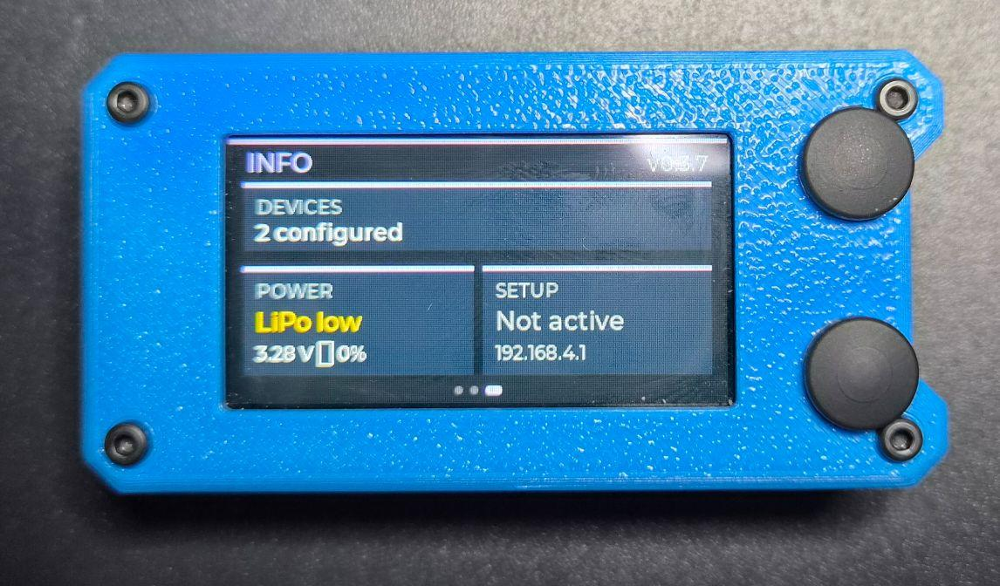

<a id="top"></a>
<div align="center">
  

  <h1>Victron Instant Readout</h1>

  <p>
    Cabin gauge for Victron kit — Instant Readout over Bluetooth, no pairing.<br>
    Same Tawni box, this firmware.
  </p>

  <p>
    <a href="https://github.com/Tawni-io/victron-instant-readout/releases"><strong>Releases</strong></a>
    ·
    <a href="https://tawni.io/victron.html"><strong>Product page</strong></a>
    ·
    <a href="https://tawni.io"><strong>tawni.io</strong></a>
  </p>

  <p>
    Current version: <strong>v0.3.8</strong>
    ·
    <a href="CHANGELOG.md">Changelog</a>
  </p>
</div>

---

<details>
  <summary><strong>Table of Contents</strong></summary>

- [About The Project](#about-the-project)
  - [Built With](#built-with)
- [Getting Started](#getting-started)
  - [Install & update](#install--update)
  - [Setup](#setup)
- [Usage](#usage)
- [Roadmap](#roadmap)
- [License](#license)

</details>

---

## 📖 About The Project

<div align="center">
  
</div>

<br>

Reads Victron **Instant Readout** advertisements over Bluetooth (no pairing). Save up to **8** devices and flip through cabin pages with the two buttons — or a swipe if the touch screen is fitted.

| Page | Kit | Shows |
| --- | --- | --- |
| Battery | SmartShunt / BMV | Voltage, charge/discharge + amps, SoC |
| Solar | MPPT | PV watts, charge state, battery V/I |
| DC-DC | Orion | Mode, in/out voltage |
| Info | This unit | Firmware version, USB vs LiPo |

Settings live on your phone, not in a cabin menu.

Tawni is **not affiliated with, endorsed by, or sponsored by Victron Energy B.V.** Victron, VictronConnect, and Instant Readout are trademarks of Victron Energy.

<p align="right">(<a href="#top">back to top</a>)</p>

### Built With

Runs on both Tawni hardware SKUs:

- **Tawni** — original / smallest pocket box
- **Rufous** — Tawni core + GPS + external antenna (GPS unused by this firmware)

Board: [LILYGO T-Display C5](https://www.lilygo.cc/products/t-display-c5) (ESP32-C5, 1.9″ 320×170)

<p align="right">(<a href="#top">back to top</a>)</p>

---

## 🚀 Getting Started

Buyers: flash from [tawni.io](https://tawni.io) or a GitHub Release `.bin`. No PlatformIO required.

### Install & update

#### Phone — later updates

1. Download `victron-instant-readout-t-display-c5-vX.Y.Z.bin` from [Releases](https://github.com/Tawni-io/victron-instant-readout/releases) (or use the flasher on [tawni.io](https://tawni.io))
2. Long-press the marked **setup** button (bottom)
3. Join Wi-Fi **VictronDash** → open `http://192.168.4.1`
4. **Firmware** → upload the `.bin` → wait for reboot

Saved devices stay after an update. Keep the unit powered during upload.

#### USB — first flash or recovery

Use a USB-C cable and the flasher on [tawni.io](https://tawni.io), or flash a Release `.bin` with your usual ESP32 tool. If the cabin does not boot after a bad upload, recover over USB, then re-add devices in setup if needed.

<!-- website:omit -->

#### Developer USB (PlatformIO)

Python 3.12+, [PlatformIO Core](https://platformio.org/install/cli), [Git](https://git-scm.com/downloads) on PATH, USB-C cable.

```bash
pio run -e bringup_ble -t upload
pio device monitor -b 115200
```

If upload fails: hold **BOOT**, tap **RST**, release **BOOT**, then upload again.

**Windows:** run this before upload so the flash progress bar does not hang the COM port:

```powershell
chcp 65001
$env:PYTHONUTF8 = "1"
$env:PYTHONIOENCODING = "utf-8"
pio run -e bringup_ble -t upload
```

<!-- /website:omit -->

### Setup

First boot with no devices: the hotspot is already on. The cabin shows **SETUP MODE**.

This firmware’s hotspot is **VictronDash**. Other Tawni firmwares use their own SSID so two boxes on the bench do not collide.

1. Join **VictronDash** (open network) → `http://192.168.4.1`
2. In VictronConnect: enable Instant Readout, copy **MAC** and **encryption key**
3. SoftAP **Nearby** (or paste MAC) → Name → key → Type → **Save device**
4. **Flip Display 180** if the unit is mounted upside-down
5. **Stop hotspot** (or long-press setup) to return to cabin pages

Keys live in on-device storage. Do not put real keys in source files.

More help: [docs/SETUP.md](docs/SETUP.md) · [docs/VICTRONCONNECT_REF.md](docs/VICTRONCONNECT_REF.md) · [docs/COMPATIBILITY.md](docs/COMPATIBILITY.md)

<p align="right">(<a href="#top">back to top</a>)</p>

---

## 🧭 Usage

Two buttons. The enclosure marks the **setup** button (bottom). Flip Display 180 does not swap them.

| Input | Action |
| --- | --- |
| Bottom short | Next page |
| Top short | Previous page |
| Bottom long (~2 s) | Setup hotspot on/off (**VictronDash**) |
| Both held (~3 s) | Soft power-off (deep sleep) |
| Bottom after wake (~1.5 s) | Stay on |

Swipe left/right does the same as next/previous if the touch screen is fitted.

<p align="right">(<a href="#top">back to top</a>)</p>

---

## 🗺️ Roadmap

- SoftAP OTA PIN / auth before wide promo
- More Instant Readout kit coverage as Victron ships it — see [docs/COMPATIBILITY.md](docs/COMPATIBILITY.md)

<p align="right">(<a href="#top">back to top</a>)</p>

---

## 📄 License

Firmware: [MIT](LICENSE). Tawni is not affiliated with Victron Energy B.V.

<!-- website:omit -->

## Build from source

```bash
pio run -e bringup_ble
```

Field binary: `.pio/build/bringup_ble/firmware.bin`  
Rename for a release: `victron-instant-readout-t-display-c5-vX.Y.Z.bin`

Public images (GitHub Releases, SoftAP, USB that leaves the bench) are **`build_type = release` only** — never `-ggdb2`.

Version string: `-DVICTRONDASH_VERSION` in `platformio.ini` (keep the `#ifndef` fallbacks in `src/main.cpp`, `src/softap/softap.cpp`, and `src/ui/splash.cpp` the same). Every GitHub Release must bump that string — splash, SoftAP, and Info all read it. Add a [CHANGELOG](CHANGELOG.md) entry, then tag `vX.Y.Z`.

Touch-IC gold test: `pio run -e bringup_touch -t upload`

## Developer docs

| Doc | What |
| --- | --- |
| [docs/FIRMWARE.md](docs/FIRMWARE.md) | OTA, slots, versioning |
| [docs/INSTANT_READOUT.md](docs/INSTANT_READOUT.md) | BLE decrypt notes |
| [docs/DASHBOARD.md](docs/DASHBOARD.md) | Cabin pages |

Vendored drivers keep their own licenses: [`lib/esp_lcd_st7789`](lib/esp_lcd_st7789) (LilyGO / João Brilha), [`lib/CST816S`](lib/CST816S) (Felix Biego).

<!-- /website:omit -->

<p align="right">(<a href="#top">back to top</a>)</p>
