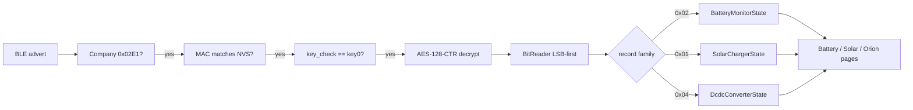

# Victron Instant Readout — sniff & decrypt

How this project reads Victron Bluetooth live data without pairing, and how we decrypt Instant Readout advertisements on the LILYGO T-Display C5.

Related: [COMPATIBILITY.md](COMPATIBILITY.md) · [DASHBOARD.md](DASHBOARD.md) · [FIRMWARE.md](FIRMWARE.md) · [SETUP.md](SETUP.md) · [VICTRONCONNECT_REF.md](VICTRONCONNECT_REF.md)

---

## What Instant Readout is

[Instant Readout](https://www.victronenergy.com/media/pg/VictronConnect_app/en/stored-trends---instant-readout.html) lets VictronConnect show key values on the device list **without opening a Bluetooth connection**. Compatible products broadcast encrypted status in BLE **advertising** packets.

Implications for our dashboard:

- We **passive-scan** only (NimBLE) — no pairing, no GATT for live values
- Better range than a connected VictronConnect session (helps cabin ↔ rear locker)
- Each Victron BLE radio needs Instant Readout **enabled** and a per-device **encryption key**
- Built-in BLE (SmartShunt / BMV-712 / SmartSolar / Orion Smart) uses the **device** key + MAC
- VE.Direct products without BLE use a **VE.Direct Bluetooth Smart dongle** (fw ≥ 2.41); key + MAC are the **dongle’s**

This is **not** Stored Trends (that is logged history over a full connection).

---

## Get the key (user steps)

See also [VICTRONCONNECT_REF.md](VICTRONCONNECT_REF.md) (screenshots + SoftAP Help copy).

1. Open VictronConnect → connect to the device (or dongle).
2. Gear → **Settings** → **⋮** → **Product info**.
3. Enable **Instant readout via Bluetooth** if it is off.
4. **Instant readout details** → **SHOW**.
5. Copy **MAC Address** and **Encryption Key** (32 hex chars).
6. Paste into our SoftAP Devices form — **never** bake keys into firmware.
7. If you change or reset the Victron Bluetooth **PIN**, the Instant Readout key **changes** — copy it again.

---

## BLE advertisement we look for

1. Scan BLE advertisements continuously.
2. Keep packets with Manufacturer Specific Data, company ID **`0x02E1`** (Victron Energy).
3. Treat the manufacturer payload (bytes after the company ID) as the Victron Instant Readout container.

Company ID appears as little-endian `E1 02` in the raw AD structure.

---

## Manufacturer payload layout

Follow the layout used by open implementations such as [keshavdv/victron-ble](https://github.com/keshavdv/victron-ble) (compatible with Victron’s extra-manufacturer-data notes):

| Offset | Size | Field | Notes |
| --- | --- | --- | --- |
| 0 | 2 | prefix | Instant Readout / product-advertisement marker (commonly related to `0x10`) |
| 2 | 2 | model_id | Victron product model (little-endian) |
| 4 | 1 | readout_type / record discriminator | Used with model to pick parser family |
| 5 | 2 | iv / nonce | Little-endian `uint16` counter for AES-CTR |
| 7 | 1 | key_check | Must equal **first byte** of the 16-byte encryption key |
| 8 | N | ciphertext | Encrypted bit-packed status (length varies by device) |

**Key check:** if `payload[7] != key[0]`, skip decrypt (wrong key or not our device). Cheap filter before AES.

**Binding:** match configured BLE MAC (per saved device, up to 8) so multiple Victron radios nearby do not collide. Each device has its own encryption key. Firmware keeps latest advert **per configured MAC** and decrypts on the main loop (not in the NimBLE callback).

### Naming — what ads expose

| Signal | In the advert? | Use |
| --- | --- | --- |
| MAC | Yes | SoftAP nearby + NVS identity |
| `model_id` | Yes | Product label (e.g. SmartShunt 500A) via lookup table |
| `record_type` | Yes | Battery / Solar / DC-DC family |
| BLE GAP local name | Often | Factory-style name if present (passive scan) |
| VictronConnect custom name | **No** | User types SoftAP **Name** |

Cerbo GX / Venus OS are not Instant Readout BLE sources for this firmware path.

---

## Decryption algorithm (AES-128-CTR)

```text
key       = 16 bytes from VictronConnect hex string
iv16      = [nonce_lo, nonce_hi, 0,0,0,0,0,0,0,0,0,0,0,0,0,0]
            where nonce = little-endian uint16 at payload[5..6]
cipher    = AES-128-CTR(key, iv16)   // counter treated little-endian
plaintext = cipher.decrypt(payload[8 .. 8+N-1])
```

Reference behaviour from `victron-ble` (`Device.decrypt`):

1. Parse container (prefix, model_id, readout_type, iv, encrypted_data starting at byte 7).
2. Verify `encrypted_data[0] == key[0]`.
3. AES-CTR with `initial_value = iv` and **little_endian** counter.
4. Decrypt `encrypted_data[1:]` → plaintext bit field.

**ESP32-C5 implementation:** mbedTLS AES-CTR (or ESP AES HAL). Do **not** PKCS-pad for mbedtls stream decrypt — decrypt the exact ciphertext length. (Python’s `pad(..., 16)` in some libraries is a convenience; treat ciphertext length as authoritative.)

### Firmware pseudo-code

```cpp
// src/victron/ir_decrypt.cpp (planned)
bool victron_ir_decrypt(const uint8_t* mfr, size_t len,
                        const uint8_t key[16],
                        uint8_t* out, size_t* out_len) {
  if (len < 9) return false;
  if (mfr[7] != key[0]) return false;          // key check
  uint8_t iv[16] = {0};
  iv[0] = mfr[5];                              // LE nonce
  iv[1] = mfr[6];
  const uint8_t* ct = mfr + 8;
  size_t ct_len = len - 8;
  // mbedtls AES-128-CTR(key, iv) -> out[0..ct_len)
  *out_len = ct_len;
  return true;
}
```

---

## After decrypt: bit-unpack by device type

Plaintext is **LSB-first bit-packed** fields (Victron “extra manufacturer data”). Use a bit reader that reads bits from low to high within each byte, advancing across the buffer.

Inner device families we care about first:

| Record / family | Hex | First product |
| --- | --- | --- |
| Solar charger | `0x01` | MPPTs (phase 2) |
| Battery monitor | `0x02` | **SmartShunt / BMV-712 (MVP)** |
| DC/DC converter | `0x04` | Orion (phase 3) |

See [COMPATIBILITY.md](COMPATIBILITY.md) for the full product matrix and other record types.

### Battery monitor (`0x02`) — cabin UI field priority

Matches [DASHBOARD.md](DASHBOARD.md) caravan / 4WD glance order:

| Priority | Field | Typical use on dashboard |
| --- | --- | --- |
| 1 | Battery voltage | Hero number (V) |
| 2 | Battery current | `CHARGING` / `DISCHARGING` / `IDLE` + rate (A); power ≈ V×I |
| 3 | State of charge | Remaining % + bar |
| 4 | Alarm reason | Red banner if set |
| Later | Aux temp / mid / starter, TTG, consumed Ah | Health / detail lines |

Handle signed currents and “NA” sentinels (e.g. all-ones / max positive) so we never show garbage.

---

## End-to-end pipeline



---

## Validation checklist (SmartShunt / BMV-712)

1. Instant Readout on; key + MAC copied.
2. VictronConnect list shows live V / I / SoC.
3. Stage A: serial print MAC, RSSI, manufacturer hex, key_check OK/FAIL.
4. Decrypt; print parsed V / I / SoC.
5. Values match VictronConnect within Instant Readout granularity.
6. Move display toward cabin; watch RSSI + stale timer.

---

## Privacy / security

- Keys unlock Instant Readout for that device — store in NVS only; SoftAP only when the user starts setup.
- BLE capture CSV may include nearby devices — default **Victron-only** filter when sharing captures.
- Instant Readout does not grant settings write access (still protect keys).

---

## Firmware build notes ([SH3D/VictronBLE](https://github.com/SH3D/VictronBLE))

Arduino/C++ Instant Readout library (MIT) — strongest **candidate dependency or vendor/fork** for decrypt + field parsers when we code firmware. Primary hosting is [gitea.sh3d.com.au](https://gitea.sh3d.com.au/Sh3d/VictronBLE); use the GitHub mirror for issues/PRs. PlatformIO: `scottp/victronble` or the `.git` URL.

Useful takeaways for our T-Display C5 build:

| Topic | Note |
| --- | --- |
| What to reuse | Shared decrypt + per-type parsers (`VictronBatteryData`, solar, DC-DC, …). Matches MVP + later types. |
| Scan HAL | Their ESP32 backend is **Bluedroid `BLEScan`**. We plan **NimBLE** on C5 — either adapt their HAL, or keep our scan and call into their `onAdvertisement` / decode path. C5 not explicitly tested (they list ESP32 / S3 / C3). |
| Crypto | Bundled AES-128-CTR (no mbedTLS required). Fine to use theirs or mbedTLS as in the pseudo-code above. |
| Rate | Victron ads ~**1 Hz**. Callbacks can be throttled (`setMinInterval`); suppress when nonce unchanged. |
| Callback context | Their data callback runs on the **BLE/scan task** — copy fields, process in `loop()` / UI task. |
| Multi-device | Same idea as SH3D `addDevice` — we store up to **8** Name/MAC/key/type rows in NVS; BLE matches any configured MAC+key; SoftAP nearby uses `model_id` + GAP name for differentiation. |
| Bring-up tips | Exact 32-hex key; Instant Readout enabled; **disconnect VictronConnect** if ads seem missing; aim RSSI **> −80 dBm** for cabin↔locker. |
| License / pin | MIT (commercial OK). Pre‑1.0 API (`v0.6` → aiming at 1.0) — **pin a git tag/commit** if we depend on it. |
| Optional later | Their ESP-NOW repeater/receiver examples — interesting if locker BLE is weak and we ever need a mid-van relay (not MVP). |

Also inspired by hoberman’s Victron BLE advertising examples and [keshavdv/victron-ble](https://github.com/keshavdv/victron-ble) (same protocol family we already document).

Decision when coding starts: try `lib_deps = scottp/victronble` on C5; if Bluedroid/NimBLE or C5 fights us, vendor decode-only and keep our NimBLE scan.

---

## References

- [VictronConnect — Stored trends & Instant readout](https://www.victronenergy.com/media/pg/VictronConnect_app/en/stored-trends---instant-readout.html)
- [keshavdv/victron-ble](https://github.com/keshavdv/victron-ble) (Python decrypt + parsers — protocol reference)
- [SH3D/VictronBLE](https://github.com/SH3D/VictronBLE) (Arduino/C++ library — **preferred firmware starting point**; MIT)
- Victron community “extra manufacturer data” notes (record type table)
- ChargeScreen UX reference for SoftAP key entry / BLE capture (not forked)
- [COMPATIBILITY.md](COMPATIBILITY.md)
- [FIRMWARE.md](FIRMWARE.md) — releases / OTA; library choice when we first flash
